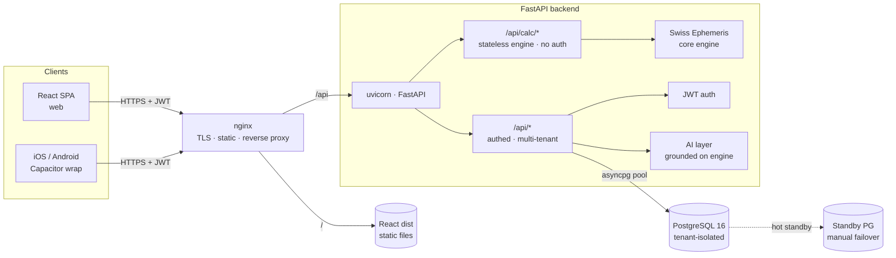

# 🪐 Jyotish — Vedic Astrology SaaS Platform

A production web + mobile platform for professional Vedic astrologers: an astronomically-accurate calculation engine, a client CRM, a gem-recommendation marketplace, and an AI interpretation layer — built as one cohesive product.

> **Status:** Production-ready — deployed and used by real paying clients.
> **Live demo:** _coming soon_ (seeded with fake data).


---

## What it does

- **Astronomical chart engine** — planetary positions, houses, and 16 divisional charts (D1–D60) computed with the **Swiss Ephemeris**, verified against professional reference software (Jagannath Hora) via an automated test suite.
- **Full Panchanga** — tithi, vara, nakshatra, yoga, karana, and sunrise-based planetary hours (hora).
- **50+ calculation modules** — Vimshottari & 8 other dasha systems, Ashtakavarga, Shadbala, KP, Jaimini, yogas, doshas, transits, compatibility (Ashtakoota), Varshaphal, Muhurta, Prashna, and more.
- **Customizable Divisional Charts Board** — astrologers pin any set of vargas side-by-side; click any planet/house for a source-cited, chart-context-aware reading.
- **Client CRM** — clients, saved charts, reading sessions, appointments, invoices, and a prediction-accuracy tracker.
- **Gem marketplace** — planet-based gemstone recommendations with a commission ledger for the astrologer.
- **AI interpretation** — chart readings grounded on the engine's real computed placements (no hallucinated positions).
- **Trilingual UI** — English / Hindi / Sanskrit (Devanagari).
- **Mobile apps** — the same React build wrapped as native iOS & Android via Capacitor.

---

## Architecture



**Deployment:** single Oracle Cloud (Always Free, ARM) VM running nginx + uvicorn + PostgreSQL, with a hot-standby database on a second node. TLS via Let's Encrypt. CI on GitHub Actions.

---

## Engineering highlights / notable decisions

- **Two-halves API design** — the calculation engine (`/api/calc/*`) is a **pure, stateless, auth-free** service; all stateful SaaS features (`/api/*`) require a JWT. This makes the math independently testable, cacheable, and reusable across web, mobile, CRM, and the gem suggester with zero drift.
- **Accuracy as a test contract** — the engine is validated against Jagannath Hora reference charts (planets to ±0.1°, houses, dashas, D9) plus a mathematical invariant (Sarvashtakavarga always sums to 337). 84 passing tests guard every change.
- **Multi-tenant isolation** — many astrologers share one database; every owned query is scoped by `user_id` from the JWT `sub`. (Documented next step: promote this to Postgres Row-Level Security so the database enforces isolation, not just application discipline.)
- **Raw SQL over an ORM** — `asyncpg` with hand-written parameterized queries: full control and no hidden N+1s across 60+ endpoints, at the cost of manual query authoring.
- **Async I/O throughout** — `async` FastAPI handlers + async Postgres driver + a connection pool, so DB-bound requests overlap on the event loop instead of blocking workers.
- **Stateless JWT auth** — no server-side session store, so any worker/node can verify any token; horizontal scaling is trivial (trade-off: revocation requires short tokens + a deny-list, a documented roadmap item).
- **Astronomical correctness details** — sidereal (Lahiri + 26 other ayanamsas), sunrise-based unequal planetary hours in Chaldean order, true vs mean nodes, whole-sign houses, and Parashari divisional-chart formulas.
- **One codebase, three targets** — the React SPA is wrapped by Capacitor into iOS and Android without a separate mobile UI.

---

## Tech stack

| Layer | Tech |
|---|---|
| Frontend | React 19, TypeScript, Vite, Zustand, Axios |
| Mobile | Capacitor 8 (iOS + Android) |
| Backend | Python 3.11, FastAPI, uvicorn (ASGI) |
| Astronomy | Swiss Ephemeris (`pyswisseph`, Moshier mode) |
| Database | PostgreSQL 16 via `asyncpg` (no ORM) |
| Auth | JWT (`python-jose`) + bcrypt (`passlib`) |
| AI | Anthropic Claude / Google Gemini (grounded prompts) |
| PDF | WeasyPrint + Jinja2 |
| Infra | Oracle Cloud (ARM), nginx, Let's Encrypt, GitHub Actions CI |

---

## Repository layout

```
backend/
  core/         # engine.py (Swiss Ephemeris), auth, db pool, varga, shadbala
  routers/      # 60+ calculation + SaaS endpoints
  tests/        # reference-value tests vs Jagannath Hora
frontend/
  src/          # React app — components, pages, i18n, api client, stores
database/
  init.sql, migrations/, seed_gems.sql, demo_seed.sql   # schema + fake demo data
deploy/         # nginx config + provisioning scripts (placeholder domains)
.github/        # CI (build + type-check + py-compile)
```

---

## Run it locally

**Prerequisites:** Python 3.11+, Node 20+, PostgreSQL 16.

```bash
# 1. Database
createdb jyotish
psql -d jyotish -f database/init.sql
psql -d jyotish -f database/migrations/002_business_modules.sql
psql -d jyotish -f database/migrations/003_gem_marketplace.sql
psql -d jyotish -f database/seed_gems.sql
# optional fake demo data:
psql -d jyotish -f database/demo_seed.sql

# 2. Backend
cd backend
python -m venv venv && source venv/bin/activate
pip install -r requirements.txt
cp .env.example .env         # fill in JWT_SECRET, DATABASE_URL, (optional) AI keys
uvicorn main:app --reload --port 8888

# 3. Frontend
cd ../frontend
npm install
cp .env.example .env.development   # VITE_API_URL=http://localhost:8888
npm run dev
```

Then open the printed Vite URL (default `http://localhost:5174`).

Environment variables are documented in `backend/.env.example` and `frontend/.env.example`. **No real secrets are committed** — the app fails fast on boot if `JWT_SECRET` is missing.

---

## My role

I **architected and built this end-to-end** — the astronomical calculation engine, the multi-tenant API, the database schema, the React/Capacitor frontend, and the Oracle Cloud deployment. I used AI coding tools as a force multiplier to move faster, but **every architectural decision, correctness trade-off, and line that ships is mine to explain and defend.** The verification test suite, the two-halves API split, the multi-tenant model, and the async/raw-SQL data layer are deliberate engineering choices, not defaults.

---

## License

[MIT](./LICENSE) © 2026 Yash Rawal
